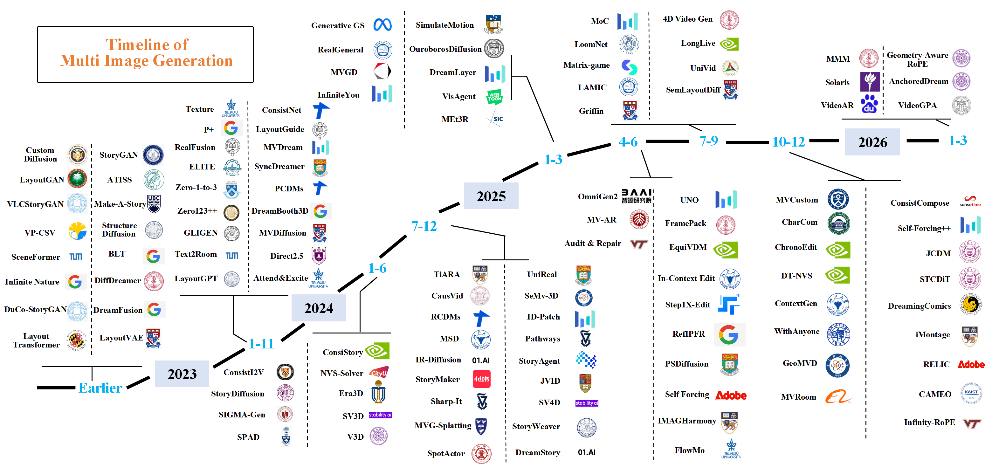
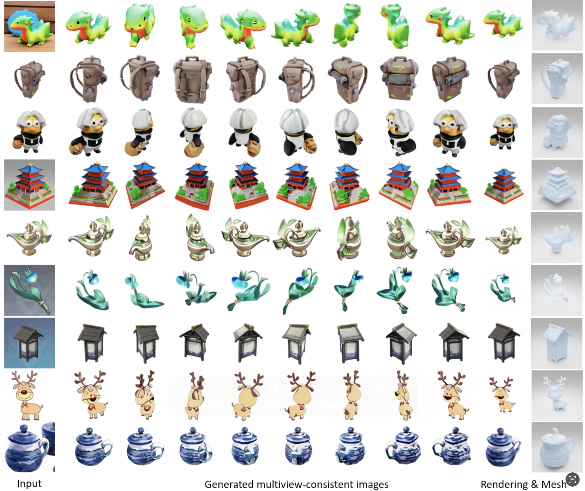
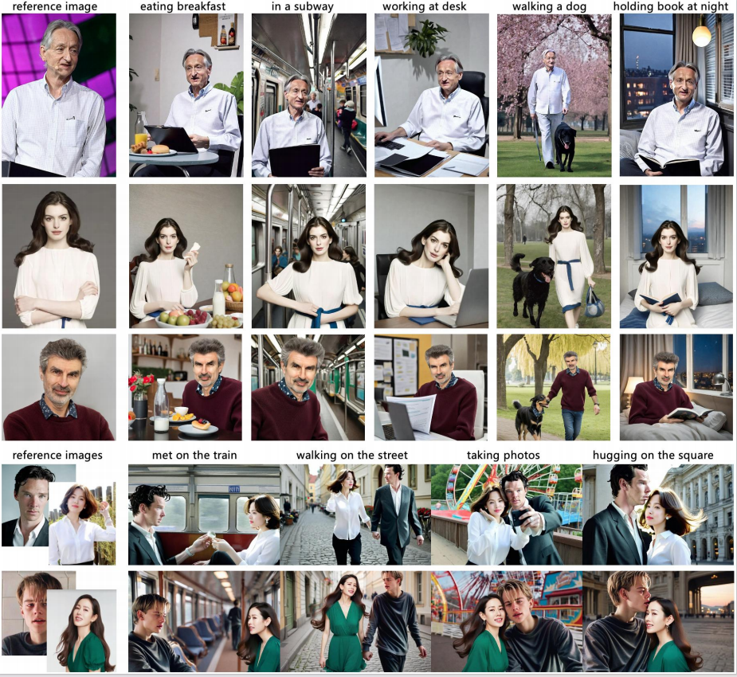
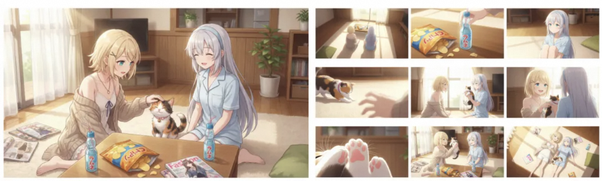

# Awesome Multi-Image Generation [](https://awesome.re)

[](./assets/timeline.pdf)

*Figure 1: Timeline of Multi-Image Generation Methods. The timeline presents the chronological development of methods organized by their respective release years.*

## 👉 What is This Repo for?

This repository provides a comprehensive collection of resources related to multi-image generation, featuring:

- A curated list of methods organized by consistency dimensions
- Categorized datasets for multi-view, character, temporal, and semantic consistency research
- Benchmarks for evaluating multi-image generation quality across different consistency types

Designed to help researchers and practitioners explore, compare, and build state-of-the-art multi-image generation systems.

## Contents

- [What is Multi-Image Generation?](#what-is-multi-image-generation)
- [Methods](#methods)
  - [Multi-View Consistency](#multi-view-consistency)
  - [Character Consistency](#character-consistency)
  - [Temporal Consistency](#temporal-consistency)
  - [Semantic Consistency](#semantic-consistency)
- [Datasets](#datasets)
  - [Multi-View Datasets](#multi-view-datasets)
  - [Character Datasets](#character-datasets)
  - [Temporal Datasets](#temporal-datasets)
  - [Semantic Datasets](#semantic-datasets)
- [Benchmarks](#benchmarks)
  - [Multi-View Benchmarks](#multi-view-benchmarks)
  - [Character Benchmarks](#character-benchmarks)
  - [Temporal Benchmarks](#temporal-benchmarks)
  - [Semantic Benchmarks](#semantic-benchmarks)
- [Applications](#applications)
- [Contributing](#contributing)
- [License](#license)
- [Citation](#citation)

## What is Multi-Image Generation?

Multi-Image Generation refers to the task of generating multiple images with inherent correlations and consistency constraints. Unlike traditional single-image generation, multi-image generation requires maintaining coherence across multiple outputs along one or more dimensions, such as geometric structure, identity attributes, temporal continuity, or semantic relationships. This repository collects methods organized by consistency dimensions, reflecting the primary type of coherence each approach aims to achieve.

<!-- <p align="center">
  <video src="assets/SyncDreamer.mp4" controls width="60%"></video><br>
</p> -->
[](assets/SyncDreamer.mp4)

*Figure 2: Example of multi-view consistency. SyncDreamer generates multi-view consistent images from a single input.*


<div align="center">
  
</div>

*Figure 3: Example of character consistency using StoryMaker. The first three rows show a day in the life of an office worker, and the last two rows are based on Before Sunrise.*

<table border="0">
  <tr style="border: none;">
    <td align="center" style="border: none;">
      <br>
      <strong>Original Input</strong><br>
    </td>
    <td align="center" valign="middle" style="border: none; font-size: 2em;">→</td>
    <td align="center" style="border: none;">
      <br>
      <strong>Step forward</strong>
    </td>
    <td align="center" valign="middle" style="border: none; font-size: 2em;">→</td>
    <td align="center" style="border: none;">
      <br>
      <strong>Look up to sky</strong>
    </td>
    <td align="center" valign="middle" style="border: none; font-size: 2em;">→</td>
    <td align="center" style="border: none;">
      <br>
      <strong>Zoom out</strong>
    </td>
  </tr>
</table>

*Figure 4: Example of temporal consistency. iMontage generates sequential image and maintains temporal consistency across generated transitions.*

<div align="center">
  
</div>

*Figure 5: Example of semantic consistency. Wan-2.7-Image transforms a single reference image into nine cohesive comic panels.*


## Methods

### Multi-View Consistency

Multi-View Consistency methods generate multiple images of the same 3D object or scene from different viewpoints while maintaining geometric coherence. This is inherently a multi-image task as it requires producing a set of views that correspond to the same underlying 3D structure, with cross-view constraints ensuring consistency across all generated perspectives.

| 🏷️ Name              | 📄 Title                                                      | 🏛️ Venue  | 📅Date   | 💻 Code                                                      | 🌐 Demo                                                       |
|------|-------|-------|------|------|------|
| Geometry-Aware RoPE | [Geometry-Aware Rotary Position Embedding for Consistent Video World Model](https://arxiv.org/abs/2602.07854) | arXiv | 2026-02 | - | - |
| AnchoredDream | [AnchoredDream: Zero-Shot 360° Indoor Scene Generation from a Single View via Geometric Grounding](https://arxiv.org/abs/2601.16532) | arXiv | 2026-01 | - | - |
| MVRoom | [MVRoom: Controllable 3D Indoor Scene Generation with Multi-View Diffusion Models](https://arxiv.org/abs/2512.04248) | arXiv | 2025-12 | - | - |
| CAMEO | [CAMEO: Correspondence-Attention Alignment for Multi-View Diffusion Models](https://arxiv.org/abs/2512.03045)  | arXiv | 2025-12 | [GitHub](https://github.com/cvlab-kaist/CAMEO) | [Demo](https://cvlab-kaist.github.io/CAMEO/) |
| DT-NVS | [DT-NVS: Diffusion Transformers for Novel View Synthesis](https://arxiv.org/abs/2511.08823) | arXiv | 2025-11 | - | - |
| GeoMVD | [GeoMVD: Geometry-Enhanced Multi-View Generation Model Based on Geometric Information Extraction](https://arxiv.org/abs/2511.12204)  | arXiv | 2025-11 | [GitHub](https://github.com/SobeyMIL/GeoMVD) | [Demo](https://sobeymil.github.io/GeoMVD.com/) |
| JCDM | [Jointly Conditioned Diffusion Model for Multi-View Pose-Guided Person Image Synthesis](https://arxiv.org/abs/2511.15092)  | arXiv | 2025-11 | [GitHub](https://github.com/DusanYule1/JCDM) | - |
| MVCustom | [MVCustom: Multi-View Customized Diffusion via Geometric Latent Rendering and Completion](https://arxiv.org/abs/2510.13702)  | ICLR | 2025-10 | [GitHub](https://github.com/minjung-s/MVCustom) | [Demo](https://minjung-s.github.io/mvcustom) |
| LoomNet | [LoomNet: Enhancing Multi-View Image Generation via Latent Space Weaving](https://arxiv.org/abs/2507.05499) | arXiv | 2025-07 | - | - |
| MV-AR | [Auto-Regressively Generating Multi-View Consistent Images](https://arxiv.org/abs/2506.18527)  | ICCV | 2025-06 | [GitHub](https://github.com/MILab-PKU/MVAR) | - |
| Generative GS | [Generative Gaussian Splatting: Generating 3D Scenes with Video Diffusion Priors](https://arxiv.org/abs/2503.13272) | ICCV | 2025-03 | - | [Demo](https://katjaschwarz.github.io/ggs/) |
| MVGD | [Zero-Shot Novel View and Depth Synthesis with Multi-View Geometric Diffusion](https://arxiv.org/abs/2501.18804) | CVPR | 2025-01 | - | [Demo](https://mvgd.github.io/) |
| MEt3R | [MEt3R: Measuring Multi-View Consistency in Generated Images](https://arxiv.org/abs/2501.06336)  | arXiv | 2025-01 | [GitHub](https://github.com/mohammadasim98/MEt3R) | [Demo](https://geometric-rl.mpi-inf.mpg.de/met3r/) |
| Sharp-It | [Sharp-It: A Multi-view to Multi-view Diffusion Model for 3D Synthesis and Manipulation](https://arxiv.org/abs/2412.02631)  | CVPR | 2024-12 | [GitHub](https://github.com/YiftachEde/Sharp-It) | [Demo](https://yiftachede.github.io/Sharp-It/) |
| SeMv-3D | [SeMv-3D: Towards Concurrency of Semantic and Multi-view Consistency in General Text-to-3D Generation](https://arxiv.org/abs/2410.07658) | arXiv | 2024-10 | - | - |
| SV4D | [SV4D: Dynamic 3D Content Generation with Multi-Frame and Multi-View Consistency](https://arxiv.org/abs/2407.17470)  | arXiv | 2024-07 | [GitHub](https://github.com/Stability-AI/generative-models) | [Demo](https://sv4d.github.io/) |
| MVG-Splatting | [MVG-Splatting: Multi-View Guided Gaussian Splatting with Adaptive Quantile-Based Geometric Consistency Densification](https://arxiv.org/abs/2407.11840) | arXiv | 2024-07 | - | [Demo](https://mvgsplatting.github.io/) |
| NVS-Solver | [NVS-Solver: Video Diffusion Model as Zero-Shot Novel View Synthesizer](https://arxiv.org/abs/2405.15364)  | ICLR | 2024-06 | [GitHub](https://github.com/ZHU-Zhiyu/NVS_Solver) | - |
| Era3D | [Era3D: High-Resolution Multiview Diffusion using Efficient Row-wise Attention](https://arxiv.org/abs/2405.11616)  | NeurIPS | 2024-05 | [GitHub](https://github.com/pengHTYX/Era3D) | [Demo](https://penghtyx.github.io/Era3D/) |
| V3D | [V3D: Video Diffusion Models are Effective 3D Generators](https://arxiv.org/abs/2403.06738)  | arXiv | 2024-03 | [GitHub](https://github.com/heheyas/V3D) | [Demo](https://heheyas.github.io/V3D/) |
| SV3D | [SV3D: Novel Multi-view Synthesis and 3D Generation from a Single Image using Latent Video Diffusion](https://arxiv.org/abs/2403.12008) | ECCV | 2024-03 | - | [Demo](https://sv3d.github.io/) |
| SPAD | [SPAD: Spatially Aware Multiview Diffusers](https://arxiv.org/abs/2402.05235)  | CVPR | 2024-02 | [GitHub](https://github.com/yashkant/spad) | [Demo](https://yashkant.github.io/spad/) |
| Direct2.5 | [Direct2.5: Diverse Text-to-3D Generation via Multi-view 2.5D Diffusion](https://arxiv.org/abs/2311.15980)  | CVPR | 2023-11 | [GitHub](https://github.com/apple/ml-direct2.5) | [Demo](https://nju-3dv.github.io/projects/direct25/) |
| Zero123++ | [Zero123++: a Single Image to Consistent Multi-view Diffusion Base Model](https://arxiv.org/abs/2310.15110)  | arXiv | 2023-10 | [GitHub](https://github.com/SUDO-AI-3D/zero123plus) | [Demo](https://huggingface.co/spaces/sudo-ai/zero123plus-demo-space) |
| ConsistNet | [ConsistNet: Enforcing 3D Consistency for Multi-view Images Diffusion](https://arxiv.org/abs/2310.10343)  | CVPR | 2023-10 | [GitHub](https://github.com/JiayuYANG/ConsistNet) | [Demo](https://jiayuyang.github.io/Consist_Net/) |
| SyncDreamer | [SyncDreamer: Generating Multiview-consistent Images from a Single-view Image](https://arxiv.org/abs/2309.03453)  | ICLR | 2023-09 | [GitHub](https://github.com/liuyuan-pal/SyncDreamer) | [Demo](https://liuyuan-pal.github.io/SyncDreamer/) |
| MVDream | [MVDream: Multi-view Diffusion for 3D Generation](https://arxiv.org/abs/2308.16512)  | arXiv | 2023-08 | [GitHub](https://github.com/bytedance/MVDream) | [Demo](https://mv-dream.github.io/) |
| MVDiffusion | [MVDiffusion: Enabling Holistic Multi-view Image Generation with Correspondence-Aware Diffusion](https://arxiv.org/abs/2307.01097)  | NeurIPS | 2023-07 | [GitHub](https://github.com/Tangshitao/MVDiffusion) | [Demo](https://mvdiffusion.github.io/) |
| Zero-1-to-3 | [Zero-1-to-3: Zero-shot One Image to 3D Object](https://arxiv.org/abs/2303.11328)  | ICCV | 2023-03 | [GitHub](https://github.com/cvlab-columbia/zero123) | [Demo](https://zero123.cs.columbia.edu/) |
| Text2Room | [Text2Room: Extracting Textured 3D Meshes from 2D Text-to-Image Models](https://arxiv.org/abs/2303.11989)  | ICCV | 2023-03 | [GitHub](https://github.com/lukasHoel/text2room) | [Demo](https://lukashoel.github.io/text-to-room/) |
| DreamBooth3D | [DreamBooth3D: Subject-Driven Text-to-3D Generation](https://arxiv.org/abs/2303.13508) | arXiv | 2023-03 | - | [Demo](https://dreambooth3d.github.io/) |
| Texture | [TEXTure: Text-Guided Texturing of 3D Shapes](https://arxiv.org/abs/2302.01721)  | SIGGRAPH | 2023-02 | [GitHub](https://github.com/TEXTurePaper/TEXTurePaper) | [Demo](https://texturepaper.github.io/TEXTurePaper/) |
| RealFusion | [RealFusion: 360° Reconstruction of Any Object from a Single Image](https://arxiv.org/abs/2302.10663)  | CVPR | 2023-02 | [GitHub](https://github.com/lukemelas/realfusion) | [Demo](https://lukemelas.github.io/realfusion/) |
| DiffDreamer | [DiffDreamer: Towards Consistent Unsupervised Single-view Scene Extrapolation with Conditional Diffusion Models](https://arxiv.org/abs/2211.12131) | ICCV | 2022-11 | - | [Demo](https://primecai.github.io/diffdreamer/) |
| DreamFusion | [DreamFusion: Text-to-3D using 2D Diffusion](https://arxiv.org/abs/2209.14988) | ICLR | 2022-09 | - | [Demo](https://dreamfusion3d.github.io/) |
| Infinite Nature | [Infinite Nature: Perpetual View Generation of Natural Scenes from a Single Image](https://arxiv.org/abs/2012.09855) | ICCV | 2020-12 | [GitHub](https://github.com/google-research/google-research/tree/master/infinite_nature) | [Demo](https://infinite-nature.github.io/) |

[⬆️ Back to Top](#contents)

### Character Consistency

Character consistency methods aim to generate images of one or more subjects while preserving their identity and key features, such as facial attributes or other key characteristics. This is inherently a multi-image problem requiring that the same subject remains recognizable across different scenes or contexts, and is widely studied in applications like storyboards and narratives.

| 🏷️ Name         | 📄 Title                                                      | 🏛️ Venue  | 📅Date   | 💻 Code                                                   | 🌐 Demo                                                   |
|------|-------|-------|------|------|------|
| Solaris | [Solaris: Building a Multiplayer Video World Model in Minecraft](https://arxiv.org/abs/2602.22208)  | arXiv | 2026-02 | [GitHub](https://github.com/solaris-wm/solaris) | [Demo](https://solaris-wm.github.io/) |
| DreamingComics | [DreamingComics: A Story Visualization Pipeline via Subject and Layout Customized Generation using Video Models](https://arxiv.org/abs/2512.01686) | arXiv | 2025-12 | - | [Demo](https://yj7082126.github.io/dreamingcomics/) |
| CharCom | [CharCom: Composable Identity Control for Multi-Character Story Illustration](https://arxiv.org/abs/2510.10135) | ACM MM | 2025-10 | - | - |
| ContextGen | [ContextGen: Contextual Layout Anchoring for Identity-Consistent Multi-Instance Generation](https://arxiv.org/abs/2510.11000)  | ICLR | 2025-10 | [GitHub](https://github.com/nenhang/ContextGen) | [Demo](https://nenhang.github.io/ContextGen/) |
| WithAnyone | [WithAnyone: Towards Controllable and ID Consistent Image Generation](https://arxiv.org/abs/2510.14975)  | ICLR | 2025-10 | [GitHub](https://github.com/Doby-Xu/WithAnyone) | [Demo](https://doby-xu.github.io/WithAnyone/) |
| OmniGen2 | [OmniGen2: Exploration to Advanced Multimodal Generation](https://arxiv.org/abs/2506.18871)  | arXiv | 2025-06 | [GitHub](https://github.com/VectorSpaceLab/OmniGen2) | [Demo](https://vectorspacelab.github.io/OmniGen2) |
| Audit & Repair | [Audit & Repair: An Agentic Framework for Consistent Story Visualization in Text-to-Image Diffusion Models](https://arxiv.org/abs/2506.18900) | arXiv | 2025-06 | - | [Demo](https://auditandrepair.github.io/) |
| RefIPFR | [Reference-Guided Identity Preserving Face Restoration](https://arxiv.org/abs/2505.21905v1)  | arXiv | 2025-05 | [GitHub](https://github.com/cdluminate/RefIPFR) | - |
| UNO | [Less-to-More Generalization: Unlocking More Controllability by In-Context Generation](https://arxiv.org/abs/2504.02160)  | arXiv | 2025-04 | [GitHub](https://github.com/bytedance/UNO) | [Demo](https://bytedance.github.io/UNO/) |
| InfiniteYou | [InfiniteYou: Flexible Photo Recrafting While Preserving Your Identity](https://arxiv.org/abs/2503.16418)  | ICCV | 2025-03 | [GitHub](https://github.com/bytedance/InfiniteYou) | [Demo](https://bytedance.github.io/InfiniteYou/) |
| StoryWeaver | [StoryWeaver: A Unified World Model for Knowledge-Enhanced Story Character Customization](https://arxiv.org/abs/2412.07375)  | AAAI | 2024-12 | [GitHub](https://github.com/Aria-Zhangjl/StoryWeaver) | - |
| IR-Diffusion | [Improving Multi-Subject Consistency in Open-Domain Image Generation with Isolation and Reposition Attention](https://arxiv.org/abs/2411.19261) | arXiv | 2024-11 | - | - |
| ID-Patch | [ID-Patch: Robust ID Association for Group Photo Personalization](https://arxiv.org/abs/2411.13632)  | CVPR | 2024-11 | [GitHub](https://github.com/bytedance/ID-Patch) | [Demo](https://byteaigc.github.io/ID-Patch/) |
| StoryAgent | [StoryAgent: Customized Storytelling Video Generation via Multi-Agent Collaboration](https://arxiv.org/abs/2411.04925) | arXiv | 2024-11 | - | - |
| StoryMaker | [StoryMaker: Towards Holistic Consistent Characters in Text-to-image Generation](https://arxiv.org/abs/2409.12576)  | arXiv | 2024-09 | [GitHub](https://github.com/FireRedTeam/StoryMaker) | - |
| DreamStory | [DreamStory: Open-Domain Story Visualization by LLM-Guided Multi-Subject Consistent Diffusion](https://arxiv.org/abs/2407.12899)  | TPAMI | 2024-07 | [GitHub](https://github.com/hehuiguo/DreamStory) | [Demo](https://dream-xyz.github.io/dreamstory) |
| SIGMA-Gen | [SIGMA-GEN: Structure and Identity Guided Multi-subject Assembly for Image Generation](https://arxiv.org/abs/2510.06469)  | arXiv | 2024-06 | [GitHub](https://github.com/oindrilasaha/SIGMA-GEN-Code) | [Demo](https://oindrilasaha.github.io/SIGMA-Gen/) |
| StoryDiffusion | [StoryDiffusion: Consistent Self-Attention for Long-Range Image and Video Generation](https://arxiv.org/abs/2405.01434)  | NeurIPS | 2024-05 | [GitHub](https://github.com/HVision-NKU/StoryDiffusion) | [Demo](https://storydiffusion.github.io/) |
| ConsiStory | [Training-Free Consistent Text-to-Image Generation](https://arxiv.org/abs/2402.03286)  | SIGGRAPH | 2024-02 | [GitHub](https://github.com/NVlabs/consistory) | [Demo](https://research.nvidia.com/labs/par/consistory/) |
| Elite | [ELITE: Encoding Visual Concepts into Textual Embeddings for Customized Text-to-Image Generation](https://arxiv.org/abs/2302.13848)  | ICCV | 2023-02 | [GitHub](https://github.com/csyxwei/ELITE) | - |
| Make-A-Story | [Make-A-Story: Visual Memory Conditioned Consistent Story Generation](https://arxiv.org/abs/2211.13319)  | CVPR | 2022-11 | [GitHub](https://github.com/ubc-vision/Make-A-Story) | - |
| VP-CSV | [Character-centric Story Visualization via Visual Planning and Token Alignment](https://arxiv.org/abs/2210.08465)  | EMNLP | 2022-10 | [GitHub](https://github.com/sairin1202/VP-CSV) | - |
| DuCo-StoryGAN | [Improving Generation and Evaluation of Visual Stories via Semantic Consistency](https://arxiv.org/abs/2105.10026)  | NAACL | 2021-05 | [GitHub](https://github.com/adymaharana/StoryViz) | - |
| StoryGAN | [StoryGAN: A Sequential Conditional GAN for Story Visualization](https://arxiv.org/abs/1812.02784)  | CVPR | 2018-12 | [GitHub](https://github.com/yitong91/StoryGAN) | - |

[⬆️ Back to Top](#contents)

### Temporal Consistency

Temporal consistency methods can be seen as multi-image generation tasks, as they involve producing a sequence of images or video frames over time. Each image or frame is generated conditioned on preceding ones, requiring smooth transitions and coherent motion, so that the temporal and physical dynamics of the sequence are preserved.

| 🏷️ Name                  | 📄 Title                                                      | 🏛️ Venue       | 📅Date   | 💻 Code                                                       | 🌐 Demo                                                       |
|------|-------|-------|------|------|------|
| MMM | [Mode Seeking meets Mean Seeking for Fast Long Video Generation](https://arxiv.org/abs/2602.24289) | arXiv | 2026-02 | - | [Demo](https://primecai.github.io/mmm/) |
| VideoGPA | [VideoGPA: Distilling Geometry Priors for 3D-Consistent Video Generation](https://arxiv.org/abs/2601.23286)  | arXiv | 2026-01 | [GitHub](https://github.com/Hongyang-Du/VideoGPA) | [Demo](https://hongyang-du.github.io/VideoGPA-Website/) |
| VideoAR | [VideoAR: Autoregressive Video Generation via Next-Frame & Scale Prediction](https://arxiv.org/abs/2601.05966)  | arXiv | 2026-01 | [GitHub](https://github.com/ernie-research/VideoAR) | [Demo](https://ernie-research.github.io/VideoAR/) |
| RELIC | [RELIC: Interactive Video World Model with Long-Horizon Memory](https://arxiv.org/abs/2512.04040) | arXiv | 2025-12 | - | - |
| Infinity-RoPE | [Infinity-RoPE: Action-Controllable Infinite Video Generation Emerges From Autoregressive Self-Rollout](https://arxiv.org/abs/2511.20649)  | CVPR | 2025-11 | [GitHub](https://github.com/yesiltepe-hidir/infinity-rope) | [Demo](https://infinity-rope.github.io/) |
| iMontage | [iMontage: Unified, Versatile, Highly Dynamic Many-to-many Image Generation](https://arxiv.org/abs/2511.20635)  | arXiv | 2025-11 | [GitHub](https://github.com/Kr1sJFU/iMontage) | [Demo](https://kr1sjfu.github.io/iMontage-web/) |
| STCDiT | [STCDiT: Spatio-Temporally Consistent Diffusion Transformer for High-Quality Video Super-Resolution](https://arxiv.org/abs/2511.18786)  | CVPR | 2025-11 | [GitHub](https://github.com/JyChen9811/STCDiT) | [Demo](https://jychen9811.github.io/STCDiT_page/) |
| ChronoEdit | [ChronoEdit: Towards Temporal Reasoning for Image Editing and World Simulation](https://arxiv.org/abs/2510.04290)  | ICLR | 2025-10 | [GitHub](https://github.com/nv-tlabs/ChronoEdit) | [Demo](https://research.nvidia.com/labs/toronto-ai/chronoedit/) |
| Self-Forcing++ | [Self-Forcing++: Towards Minute-Scale High-Quality Video Generation](https://arxiv.org/abs/2510.02283)  | arXiv | 2025-10 | [GitHub](https://github.com/justincui03/Self-Forcing-Plus-Plus) | [Demo](https://self-forcing-plus-plus.github.io/) |
| LongLive | [LongLive: Real-time Interactive Long Video Generation](https://arxiv.org/abs/2509.22622)  | ICLR | 2025-09 | [GitHub](https://github.com/NVlabs/LongLive) | [Demo](https://nvlabs.github.io/LongLive/) |
| Mixture of Contexts (MoC) | [Mixture of Contexts for Long Video Generation](https://arxiv.org/abs/2508.21058) | ICLR | 2025-08 | - | [Demo](https://primecai.github.io/moc/) |
| Matrix-Game 2.0 | [Matrix-Game 2.0: An Open-Source Real-Time and Streaming Interactive World Model](https://arxiv.org/abs/2508.13009)  | arXiv | 2025-08 | [GitHub](https://github.com/SkyworkAI/Matrix-Game/tree/main/Matrix-Game-2) | [Demo](https://matrix-game-v2.github.io/) |
| 4D Video Generation | [Geometry-aware 4D Video Generation for Robot Manipulation](https://arxiv.org/abs/2507.01099)  | ICLR | 2025-07 | [GitHub](https://github.com/lzylucy/4dgen) | [Demo](https://robot4dgen.github.io/) |
| Self Forcing | [Self Forcing: Bridging the Train-Test Gap in Autoregressive Video Diffusion](https://arxiv.org/abs/2506.08009)  | NeurIPS | 2025-06 | [GitHub](https://github.com/guandeh17/Self-Forcing) | [Demo](http://self-forcing.github.io/) |
| FlowMo | [FlowMo: Variance-Based Flow Guidance for Coherent Motion in Video Generation](https://arxiv.org/abs/2506.01144)  | arXiv | 2025-06 | [GitHub](https://github.com/arielshaulov/FlowMo) | [Demo](https://arielshaulov.github.io/FlowMo/) |
| FramePack | [Frame Context Packing and Drift Prevention in Next-Frame-Prediction Video Diffusion Models](https://arxiv.org/abs/2504.12626)  | arXiv | 2025-04 | [GitHub](https://github.com/lllyasviel/FramePack) | [Demo](https://lllyasviel.github.io/frame_pack_gitpage/) |
| EquiVDM | [On Equivariance and Fast Sampling in Video Diffusion Models Trained with Warped Noise](https://arxiv.org/abs/2504.09789) | arXiv | 2025-04 | - | - |
| RealGeneral | [RealGeneral: Unifying Visual Generation via Temporal In-Context Learning with Video Models](https://arxiv.org/abs/2503.10406)  | ICCV | 2025-03 | [GitHub](https://github.com/Lyne1/RealGeneral) | [Demo](https://lyne1.github.io/realgeneral_web/) |
| SimulateMotion | [Training-Free Motion-Guided Video Generation with Enhanced Temporal Consistency Using Motion Consistency Loss](https://arxiv.org/abs/2501.07563) | arXiv | 2025-01 | - | [Demo](https://zhangxinyu-xyz.github.io/SimulateMotion.github.io/) |
| Ouroboros-Diffusion | [Ouroboros-Diffusion: Exploring Consistent Content Generation in Tuning-free Long Video Diffusion](https://arxiv.org/abs/2501.09019)  | AAAI | 2025-01 | [GitHub](https://github.com/jingyuanchan/Ouroboros-Diffusion) | - |
| CausVid | [CausVid: From Slow Bidirectional to Fast Autoregressive Video Diffusion Models](https://arxiv.org/abs/2412.07772)  | CVPR | 2024-12 | [GitHub](https://github.com/tianweiy/CausVid) | [Demo](https://causvid.github.io/) |
| TiARA | [Enhancing Long Video Generation Consistency without Tuning](https://arxiv.org/abs/2412.17254) | ICML Workshop | 2024-12 | - | - |
| Pathways | [Pathways on the Image Manifold: Image Editing via Video Generation](https://arxiv.org/abs/2411.16819)  | CVPR | 2024-11 | [GitHub](https://github.com/RotsteinNoam/Frame2Frame) | [Demo](https://rotsteinnoam.github.io/Frame2Frame/) |
| JVID | [JVID: Joint Video-Image Diffusion for Visual-Quality and Temporal-Consistency in Video Generation](https://arxiv.org/abs/2409.14149) | arXiv | 2024-09 | - | - |
| RCDMs | [Boosting Consistency in Story Visualization with Rich-Contextual Conditional Diffusion Models](https://arxiv.org/abs/2407.02482)  | AAAI | 2024-07 | [GitHub](https://github.com/muzishen/RCDMs) | - |
| ConsistI2V | [ConsistI2V: Enhancing Visual Consistency for Image-to-Video Generation](https://arxiv.org/abs/2402.04324)  | arXiv | 2024-02 | [GitHub](https://github.com/TIGER-AI-Lab/ConsistI2V) | [Demo](https://tiger-ai-lab.github.io/ConsistI2V/) |

[⬆️ Back to Top](#contents)

### Semantic Consistency

Semantic consistency is essential for multi-image generation. These methods ensure that multiple generated images maintain coherent layouts, logical semantic relationships, and overall scene structure. In tasks like controllable generation, iterative image editing, and multi-region editing, semantic consistency provides the structural constraints needed to prevent conflicting content across different outputs.

| 🏷️ Name              | 📄 Title                                                      | 🏛️ Venue  | 📅Date   | 💻 Code                                                       | 🌐 Demo                                                       |
|------|-------|-------|------|------|------|
| ConsistCompose | [ConsistCompose: Unified Multimodal Layout Control for Image Composition](https://arxiv.org/abs/2511.18333) | CVPR | 2025-11 | - | - |
| Griffin | [Griffin: Generative Reference and Layout Guided Image Composition](https://arxiv.org/abs/2509.23643) | arXiv | 2025-09 | - | - |
| UniVid | [UniVid: Unifying Vision Tasks with Pre-trained Video Generation Models](https://arxiv.org/abs/2509.21760)  | WACV | 2025-09 | [GitHub](https://github.com/CUC-MIPG/UniVid) | - |
| SemLayoutDiff | [SemLayoutDiff: Semantic Layout Generation with Diffusion Model for Indoor Scene Synthesis](https://arxiv.org/abs/2508.18597)  | arXiv | 2025-08 | [GitHub](https://github.com/3dlg-hcvc/SemLayoutDiff) | [Demo](https://3dlg-hcvc.github.io/SemLayoutDiff/) |
| LAMIC | [LAMIC: Layout-Aware Multi-Image Composition via Scalability of Multimodal Diffusion Transformer](https://arxiv.org/abs/2508.00477)  | AAAI | 2025-08 | [GitHub](https://github.com/Suchenl/LAMIC) | - |
| IMAGHarmony | [IMAGHarmony: Controllable Image Editing with Consistent Object Quantity and Layout](https://arxiv.org/abs/2506.01949)  | arXiv | 2025-06 | [GitHub](https://github.com/muzishen/IMAGHarmony) | [Demo](https://revive234.github.io/IMAGHarmony.github.io/) |
| PSDiffusion | [PSDiffusion: Harmonized Multi-Layer Image Generation via Layout and Appearance Alignment](https://arxiv.org/abs/2505.11468)  | arXiv | 2025-05 | [GitHub](https://github.com/dingbang777/PSDiffusion/) | - |
| In-Context Edit | [In-Context Edit: Enabling Instructional Image Editing with In-Context Generation in Large Scale Diffusion Transformer](https://arxiv.org/abs/2504.20690)  | NeurIPS | 2025-04 | [GitHub](https://github.com/River-Zhang/ICEdit) | [Demo](https://river-zhang.github.io/ICEdit-gh-pages/) |
| Step1X-Edit | [Step1X-Edit: A Practical Framework for General Image Editing](https://arxiv.org/abs/2504.17761)  | arXiv | 2025-04 | [GitHub](https://github.com/stepfun-ai/Step1X-Edit) | - |
| VisAgent | [VisAgent: Narrative-Preserving Story Visualization Framework](https://arxiv.org/abs/2503.02399v1) | ICASSP | 2025-03 | - | - |
| DreamLayer | [DreamLayer: Simultaneous Multi-Layer Generation via Diffusion Model](https://arxiv.org/abs/2503.12838) | arXiv | 2025-03 | - | [Demo](https://ll3rd.github.io/DreamLayer/) |
| UniReal | [UniReal: Universal Image Generation and Editing via Learning Real-world Dynamics](https://arxiv.org/abs/2412.07774)  | arXiv | 2024-12 | [GitHub](https://github.com/XavierCHEN34/UniReal) | [Demo](https://xavierchen34.github.io/UniReal-Page/) |
| MSD | [Multi-Scale Diffusion: Enhancing Spatial Layout in High-Resolution Panoramic Image Generation](https://arxiv.org/abs/2410.18830) | arXiv | 2024-10 | - | - |
| SpotActor | [SpotActor: Training-Free Layout-Controlled Consistent Image Generation](https://arxiv.org/abs/2409.04801) | arXiv | 2024-09 | - | - |
| PCDMs | [Advancing Pose-Guided Image Synthesis with Progressive Conditional Diffusion Models](https://arxiv.org/abs/2310.06313)  | ICLR | 2023-10 | [GitHub](https://github.com/tencent-ailab/PCDMs) | - |
| LayoutGPT | [LayoutGPT: Compositional Visual Planning and Generation with Large Language Models](https://arxiv.org/abs/2305.15393)  | NeurIPS | 2023-05 | [GitHub](https://github.com/weixi-feng/LayoutGPT) | [Demo](https://layoutgpt.github.io/) |
| Layout-Guidance | [Training-Free Layout Control with Cross-Attention Guidance](https://arxiv.org/abs/2304.03373)  | WACV | 2023-04 | [GitHub](https://github.com/silent-chen/layout-guidance) | [Demo](https://silent-chen.github.io/layout-guidance/) |
| P+ | [P+: Extended Textual Conditioning in Text-to-Image Generation](https://arxiv.org/abs/2303.09522) | arXiv | 2023-03 | - | [Demo](https://prompt-plus.github.io/) |
| GLIGEN | [GLIGEN: Open-Set Grounded Text-to-Image Generation](https://arxiv.org/abs/2301.07093)  | CVPR | 2023-01 | [GitHub](https://github.com/gligen/GLIGEN) | [Demo](https://gligen.github.io/) |
| Attend-and-Excite | [Attend-and-Excite: Attention-Based Semantic Guidance for Text-to-Image Diffusion Models](https://arxiv.org/abs/2301.13826)  | SIGGRAPH | 2023-01 | [GitHub](https://github.com/yuval-alaluf/Attend-and-Excite) | [Demo](https://yuval-alaluf.github.io/Attend-and-Excite/) |
| Custom Diffusion | [Multi-Concept Customization of Text-to-Image Diffusion](https://arxiv.org/abs/2212.04488)  | CVPR | 2022-12 | [GitHub](https://github.com/adobe-research/custom-diffusion) | [Demo](https://www.cs.cmu.edu/~custom-diffusion/) |
| Structure Diffusion | [Training-Free Structured Diffusion Guidance for Compositional Text-to-Image Synthesis](https://arxiv.org/abs/2212.05032)  | ICLR | 2022-12 | [GitHub](https://github.com/weixi-feng/Structured-Diffusion-Guidance) | [Demo](https://weixi-feng.github.io/structure-diffusion-guidance/) |
| BLT | [BLT: Bidirectional Layout Transformer for Controllable Layout Generation](https://arxiv.org/abs/2112.05112)  | ECCV | 2021-12 | [GitHub](https://github.com/google-research/google-research/tree/master/layout-blt) | [Demo](https://shawnkx.github.io/blt) |
| VLCStoryGAN | [Integrating Visuospatial, Linguistic and Commonsense Structure into Story Visualization](https://arxiv.org/abs/2110.10834) | EMNLP | 2021-10 | - | - |
| ATISS | [ATISS: Autoregressive Transformers for Indoor Scene Synthesis](https://arxiv.org/abs/2110.03675)  | NeurIPS | 2021-10 | [GitHub](https://github.com/nv-tlabs/ATISS) | [Demo](https://research.nvidia.com/labs/toronto-ai/ATISS/) |
| SceneFormer | [SceneFormer: Indoor Scene Generation with Transformers](https://arxiv.org/abs/2012.09793)  | 3DV | 2020-12 | [GitHub](https://github.com/cy94/sceneformer) | [Demo](https://xinpeng-wang.github.io/sceneformer/) |
| Layout Transformer | [LayoutTransformer: Layout Generation and Completion with Self-Attention](https://arxiv.org/abs/2006.14615)  | ICCV | 2020-06 | [GitHub](https://github.com/kampta/DeepLayout) | [Demo](https://kampta.github.io/layout/) |
| LayoutVAE | [LayoutVAE: Stochastic Scene Layout Generation From a Label Set](https://arxiv.org/abs/1907.10719) | ICCV | 2019-07 | - | - |
| LayoutGAN | [LayoutGAN: Generating Graphic Layouts with Wireframe Discriminators](https://arxiv.org/abs/1901.06767)  | ICLR | 2019-01 | [GitHub](https://github.com/billzhonggz/LayoutGAN) | - |

[⬆️ Back to Top](#contents)

## Datasets

### Multi-View Datasets

| 🗄️ Dataset                                                    | 📊 Samples                      | 📄 Paper                                                      | 🏛️ Venue       | 📅 Date  |
|---------|---------|-------|-------|------|
| [Griffin](https://huggingface.co/datasets/wjh-svm/Griffin) | ~30,000 frames, 270,000 images | [Griffin: Aerial-Ground Cooperative Detection and Tracking Dataset and Benchmark](https://arxiv.org/abs/2503.06983) | AAAI | 2025-03 |
| [MVImgNet2.0](https://github.com/GAP-LAB-CUHK-SZ/MVImgNet2.0) | 520k | [MVImgNet2.0: A Larger-scale Dataset of Multi-view Images](https://arxiv.org/abs/2412.01430) | SIGGRAPH Asia | 2024-12 |
| [OpenMaterial](https://huggingface.co/datasets/EPFL-CVLab/OpenMaterial) | 1,001 | [OpenMaterial: A Large-scale Dataset of Complex Materials for 3D Reconstruction](https://arxiv.org/abs/2406.08894) | arXiv | 2024-06 |
| [Objaverse-XL](https://huggingface.co/datasets/allenai/objaverse-xl) | 10M+ | [Objaverse-XL: A Universe of 10M+ 3D Objects](https://arxiv.org/abs/2307.05663) | arXiv | 2023-07 |
| [Objaverse](https://huggingface.co/datasets/allenai/objaverse-xl) | 800k+ | [Objaverse: A Universe of Annotated 3D Objects](https://arxiv.org/abs/2212.08051) | CVPR | 2022-11 |
| [CO3D](https://github.com/facebookresearch/co3d) | 19K | [Common Objects in 3D: Large-Scale Learning and Evaluation of Real-life 3D Category Reconstruction](https://arxiv.org/abs/2109.00512) | ICCV | 2021-09 |

[⬆️ Back to Top](#contents)

### Character Datasets

| 🗄️ Dataset                                                    | 📊 Samples                  | 📄 Paper                                                      | 🏛️ Venue | 📅 Date  |
|---------|---------|-------|-------|------|
| [WildActor](https://huggingface.co/papers/2603.00586) | 1.6M videos, 18M frames | [WildActor: Unconstrained Identity-Preserving Video Generation](https://arxiv.org/abs/2603.00586) | arXiv | 2026-03 |
| [Solaris Dataset](https://huggingface.co/collections/nyu-visionx/solaris-data) | 12.64M frames | [Solaris: Building a Multiplayer Video World Model in Minecraft](https://arxiv.org/abs/2602.22208) | arXiv | 2026-02 |
| 2K-Characters-10K-Stories | 2K chars, 10K stories | [2K-Characters-10K-Stories: A Quality-Gated Stylized Narrative Dataset with Disentangled Control and Sequence Consistency](https://arxiv.org/abs/2512.05557) | arXiv | 2025-12 |
| OmniPerson | 2000k | [OmniPerson: Unified Identity-Preserving Pedestrian Generation](https://arxiv.org/abs/2512.02554) | arXiv | 2025-12 |
| [WithAnyone](https://huggingface.co/datasets/WithAnyone/MultiID-2M) | 2M | [WithAnyone: Towards Controllable and ID Consistent Image Generation](https://arxiv.org/abs/2510.14975) | ICLR | 2025-10 |
| MultiHuman-Testbench | 1,800 samples, 5,550 faces | [MultiHuman-Testbench: Benchmarking Image Generation for Multiple Humans](https://arxiv.org/abs/2506.20879) | NeurIPS | 2025-06 |
| [Openstory++](https://huggingface.co/datasets/MAPLE-WestLake-AIGC/OpenstoryPlusPlus) | 796k | [Openstory++: A Large-scale Dataset and Benchmark for Instance-aware Open-domain Visual Storytelling](https://arxiv.org/abs/2408.03695) | arXiv | 2024-08 |
| MIS | 12M | [Many-to-many Image Generation with Auto-regressive Diffusion Models](https://arxiv.org/abs/2404.03109) | arXiv | 2024-03 |

[⬆️ Back to Top](#contents)

### Temporal Datasets

| 🗄️ Dataset                                                    | 📊 Samples                    | 📄 Paper                                                      | 🏛️ Venue | 📅 Date  |
|---------|---------|-------|-------|------|
| [GenVID](https://genvidbench.github.io/) | 80k | [Artifact-Aware Evaluation for High-Quality Video Generation](https://arxiv.org/abs/2601.20297) | arXiv | 2026-01 |
| [SeqBench](https://huggingface.co/datasets/AcmmmVideobench/Acmmm2025_video_benchmark) | 320 prompts, 2,560 videos | [SeqBench: Benchmarking Sequential Narrative Generation in Text-to-Video Models](https://arxiv.org/abs/2510.13042) | arXiv | 2025-10 |
| GeneVA | 5,452 prompts, 16,356 videos | [GeneVA: A Dataset of Human Annotations for Generative Text to Video Artifacts](https://arxiv.org/abs/2509.08818) | arXiv | 2025-09 |
| [BrokenVideos](https://pan.baidu.com/share/init?surl=FQbUXuoPm3rOtamUzTtOWA&pwd=i38e) | 3,254 | [BrokenVideos: A Benchmark Dataset for Fine-Grained Artifact Localization in AI-Generated Videos](https://arxiv.org/abs/2506.20103) | arXiv | 2025-06 |
| [FlintstonesSV](https://huggingface.co/datasets/Janak12/FlintstonesSV_Plus_Plus) | 20k | [FlintstonesSV++ : Improving Story Narration using Visual Scene Graph](https://ceur-ws.org/Vol-3964/paper3.pdf) | ECIR | 2025-04 |
| MovieBench | from 160 movies | [MovieBench: A Hierarchical Movie Level Dataset for Long Video Generation](https://arxiv.org/abs/2411.15262) | CVPR | 2024-06 |
| PororoSV                                                     | 14k+                         | [Storygan: A sequential conditional gan for story visualization](https://arxiv.org/abs/1812.02784) | arXiv | 2018-12 |

[⬆️ Back to Top](#contents)

### Semantic Datasets

| 🗄️ Dataset                                                    | 📊 Samples | 📄 Paper                                                      | 🏛️ Venue | 📅 Date  |
|---------|---------|-------|-------|------|
| [MICo-150K](https://huggingface.co/datasets/kr-cen/MICo-150K) | 150k | [MICo-150K: A Comprehensive Dataset Advancing Multi-Image Composition](https://arxiv.org/abs/2512.07348) | CVPR | 2025-12 |
| [Echo-4o](https://huggingface.co/datasets/Yejy53/Echo-4o-Image) | 180k | [Echo-4o: Harnessing the Power of GPT-4o Synthetic Images for Improved Image Generation](https://arxiv.org/abs/2508.09987) | arXiv | 2025-08 |
| [LAION-SG](https://huggingface.co/datasets/mengcy/LAION-SG) | 482k | [LAION-SG: An Enhanced Large-Scale Dataset for Training Complex Image-Text Models with Structural Annotations](https://arxiv.org/abs/2412.08580) | arXiv | 2024-12 |
| SynCD | 90k | [Generating Multi-Image Synthetic Data for Text-to-Image Customization](https://arxiv.org/abs/2502.01720v2) | ICCV | 2025-02 |

[⬆️ Back to Top](#contents)

## Benchmarks

### Multi-View Benchmarks

| 🏷️ Name                  | 📄 Paper                                                      | 🏛️ Venue | 📅 Date  | 💻 Code                                                      |
|------|-------|-------|------|------|
| Charge | [Charge: A Comprehensive Novel View Synthesis Benchmark and Dataset to Bind Them All](https://arxiv.org/abs/2512.13639) | arXiv | 2025-12 | - |
| MVGBench | [MVGBench: A Comprehensive Benchmark for Multi-view Generation Models](https://arxiv.org/abs/2507.00006) | ICCV | 2025-07 | [GitHub](https://github.com/xiexh20/MVGBench) |
| Griffin | [Griffin: Aerial-Ground Cooperative Detection and Tracking Dataset and Benchmark](https://arxiv.org/abs/2503.06983) | AAAI | 2025-03 | [GitHub](https://github.com/wang-jh18-svm/griffin) |
| MEt3R | [MEt3R: Measuring Multi-View Consistency in Generated Images](https://arxiv.org/abs/2501.06336) | CVPR | 2025-01 | [GitHub](https://github.com/mohammadasim98/met3r) |
| Robust Multi-View Depth | [A Benchmark and a Baseline for Robust Multi-view Depth Estimation](https://arxiv.org/abs/2209.06681) | 3DV | 2022-09 | [GitHub](https://github.com/lmb-freiburg/robustmvd) |

[⬆️ Back to Top](#contents)

### Character Benchmarks

| 🏷️ Name               | 📄 Paper                                                      | 🏛️ Venue | 📅 Date  | 💻 Code                                                       |
|------|-------|-------|------|------|
| Solaris Benchmark | [Solaris: Building a Multiplayer Video World Model in Minecraft](https://arxiv.org/abs/2602.22208) | arXiv | 2026-02 | [GitHub](https://github.com/solaris-wm/solaris) |
| IdentityStory | [IdentityStory: Taming Your Identity-Preserving Generator for Human-Centric Story Generation](https://arxiv.org/abs/2512.23519) | AAAI | 2025-12 | [GitHub](https://github.com/Correr-Zhou/IdentityStory) |
| Envision | [Envision: Benchmarking Unified Understanding & Generation for Causal World Process Insights](https://arxiv.org/abs/2512.01816) | arXiv | 2025-12 | [GitHub](https://github.com/OpenRaiser/Envision) |
| OmniContext | [OmniGen2: Exploration to Advanced Multimodal Generation](https://arxiv.org/abs/2506.18871) | arXiv | 2025-06 | [GitHub](https://github.com/VectorSpaceLab/OmniGen2) |
| MultiHuman-Testbench | [MultiHuman-Testbench: Benchmarking Image Generation for Multiple Humans](https://arxiv.org/abs/2506.20879) | NeurIPS | 2025-06 | [GitHub](https://github.com/Qualcomm-AI-research/MultiHuman-Testbench) |
| ViStoryBench | [ViStoryBench: Comprehensive Benchmark Suite for Story Visualization](https://arxiv.org/abs/2505.24862) | CVPR | 2025-05 | [GitHub](https://github.com/vistorybench/vistorybench) |
| TBC-Bench | [StoryWeaver: A Unified World Model for Knowledge-Enhanced Story Character Customization](https://arxiv.org/abs/2412.07375) | AAAI | 2024-12 | [GitHub](https://github.com/Aria-Zhangjl/StoryWeaver) |
| DS-500 | [DreamStory: Open-Domain Story Visualization by LLM-Guided Multi-Subject Consistent Diffusion](https://arxiv.org/abs/2407.12899) | TPAMI | 2024-07 | [GitHub](https://github.com/hehuiguo/DreamStory) |
| NewEpisode | [Evolving Storytelling: Benchmarks and Methods for New Character Customization with Diffusion Models](https://arxiv.org/abs/2405.11852) | arXiv | 2024-05 | - |

[⬆️ Back to Top](#contents)

### Temporal Benchmarks

| 🏷️ Name                  | 📄 Paper                                                      | 🏛️ Venue | 📅 Date  | 💻 Code                                                       |
|:----:|-------|-------|------|------|
| SeqBench | [SeqBench: Benchmarking Sequential Narrative Generation in Text-to-Video Models](https://arxiv.org/abs/2510.13042) | arXiv | 2025-10 | [GitHub](https://github.com/TangZhengxu/SeqBench-Benchmarking-Sequential-Narrative-Generation-in-Text-to-Video-Models) |
| World Consistency Score | [World Consistency Score: A Unified Metric for Video Generation Quality](https://arxiv.org/abs/2508.00144) | ICCV | 2025-08 | [GitHub](https://github.com/haoyi-duan/WorldScore) |
| VBench++ | [VBench++: Comprehensive and Versatile Benchmark Suite for Video Generative Models](https://arxiv.org/abs/2411.13503) | TPAMI | 2024-11 | [GitHub](https://github.com/Vchitect/VBench) |
| TC-Bench | [TC-Bench: Benchmarking Temporal Compositionality in Text-to-Video and Image-to-Video Generation](https://arxiv.org/abs/2406.08656) | arXiv | 2024-06 | [GitHub](https://github.com/weixi-feng/TC-Bench) |
| MovieBench | [MovieBench: A Hierarchical Movie Level Dataset for Long Video Generation](https://arxiv.org/abs/2411.15262) | CVPR | 2024-06 | [GitHub](https://github.com/showlab/MovieBench) |
| VBench | [VBench: Comprehensive Benchmark Suite for Video Generative Models](https://arxiv.org/abs/2311.17982) | CVPR | 2023-11 | [GitHub](https://github.com/Vchitect/VBench) |

[⬆️ Back to Top](#contents)

### Semantic Benchmarks

| 🏷️ Name            | 📄 Paper                                                      | 🏛️ Venue | 📅 Date  | 💻 Code                                                  |
|------|-------|-------|------|------|
| 3SGen-Bench | [3SGen: Unified Subject, Style, and Structure-Driven Image Generation with Adaptive Task-specific Memory](https://arxiv.org/abs/2512.19271) | arXiv | 2025-12 | - |
| MICo-150K | [MICo-150K: A Comprehensive Dataset Advancing Multi-Image Composition](https://arxiv.org/abs/2512.07348) | CVPR | 2025-12 | [GitHub](https://github.com/A113N-W3I/MICo-150K) |
| M³T2IBench | [M³T2IBench: A Large-Scale Multi-Category, Multi-Instance, Multi-Relation Text-to-Image Benchmark](https://arxiv.org/abs/2510.23020) | arXiv | 2025-10 | - |
| LAMIC | [LAMIC: Layout-Aware Multi-Image Composition via Scalability of Multimodal Diffusion Transformer](https://arxiv.org/abs/2508.00477v2) | AAAI | 2025-08 | [GitHub](https://github.com/Suchenl/LAMIC) |
| MMIG-Bench | [MMIG-Bench: Towards Comprehensive and Explainable Evaluation of Multi-Modal Image Generation Models](https://arxiv.org/abs/2505.19415) | arXiv | 2025-05 | [GitHub](https://github.com/hanghuacs/MMIG-Bench) |
| ImgEdit Benchmark | [ImgEdit: A Unified Image Editing Dataset and Benchmark](https://arxiv.org/abs/2505.20275) | NeurIPS | 2025-05 | [GitHub](https://github.com/PKU-YuanGroup/ImgEdit) |
| GEdit-Bench | [Step1X-Edit: A Practical Framework for General Image Editing](https://arxiv.org/abs/2504.17761) | arXiv | 2025-04 | [GitHub](https://huggingface.co/stepfun-ai/Step1X-Edit) |
| MRAMG-Bench | [MRAMG-Bench: A Comprehensive Benchmark for Advancing Multimodal Retrieval-Augmented Multimodal Generation](https://arxiv.org/abs/2502.04176) | SIGIR | 2025-02 | [GitHub](https://github.com/MRAMG-Bench/MRAMG) |
| T2I-CompBench++ | [T2I-CompBench++: An Enhanced and Comprehensive Benchmark for Compositional Text-to-image Generation](https://arxiv.org/abs/2307.06350) | TPAMI | 2023-07 | [GitHub](https://github.com/Karine-Huang/T2I-CompBench) |

[⬆️ Back to Top](#contents)

## Applications

| 🏷️Name | 🌐 Demo |
|------|------|
| World Labs | [Demo](https://www.worldlabs.ai/) |
| Skybox AI | [Demo](https://www.blockadelabs.com/) |
| Luma | [Demo](https://lumalabs.ai/dream-machine) |
| Canva AI | [Demo](https://www.canva.com/features/ai-video-generator/) |
| Kling AI | [Demo](https://klingai.com/) |
| Runway | [Demo](https://runwayml.com/product) |
| Multiverse | [Demo](https://enigma.inc/) |
| Rodin | [Demo](https://hyperhuman.deemos.com/) |

[⬆️ Back to Top](#contents)

## Contributing

Contributions are welcome! Please feel free to submit a Pull Request. When adding new papers, please follow these rules:
1. Ensure the paper is relevant to multi-image generation.
2. Insert the new entry in reverse chronological order (newest first).
3. Add links to paper and code (if available)

## License

This project is released under Apache License 2.0 (http://www.apache.org/licenses/LICENSE-2.0, SPDX-License-identifier: Apache-2.0).

## Citation

If you find this repo is helpful for your research, please cite our paper:

📄 **[A Survey on Multi-Image Generation: Advances, Challenges, and Future Directions](https://www.researchgate.net/publication/404851160_A_Survey_on_Multi-Image_Generation_Advances_Challenges_and_Future_Directions)**

```
@article{chen2026survey,
  title={A Survey on Multi-Image Generation: Advances, Challenges, and Future Directions},
  author={Chen, Qirui and Wang, Guo-Hua and Chen, Jinyuan and Chen, Qing-Guo and Zhang, Jun and Luo, Weihua},
  year={2026}
}
```
